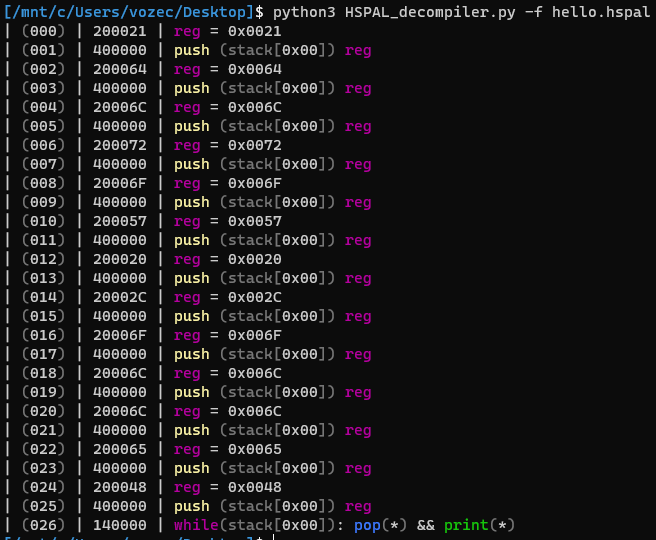
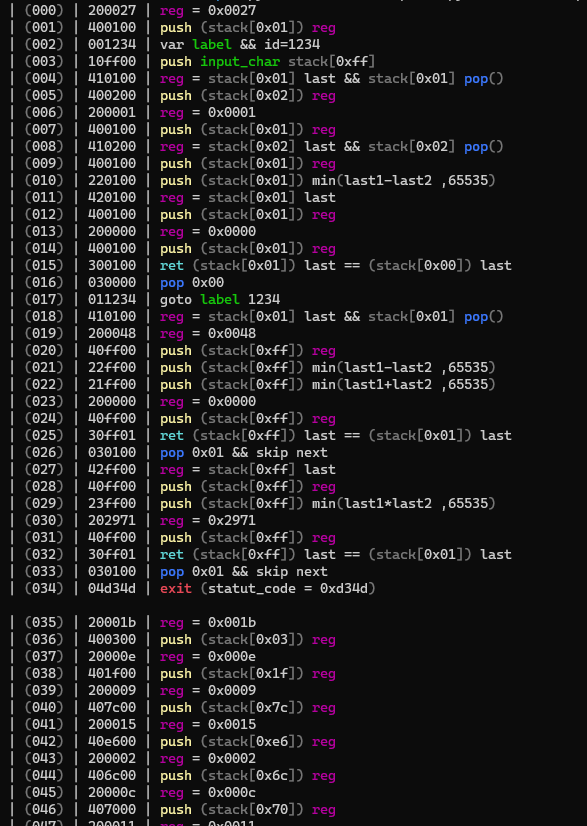
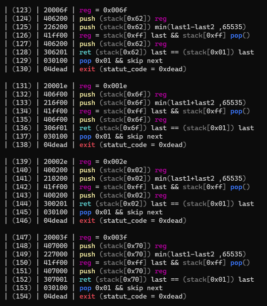

# HSPAL-Decompiler
 This tool allows you to generate pseudo-code for the language esolang [HSPAL](https://esolangs.org/wiki/Hexadecimal_Stacking_Pseudo-Assembly_Language)

# Documentation:
- Instruction format is as: ``ABXXYY``
  - ``A`` : is the instruction group
  - ``B`` : is the instruction group

- __Instruction group 0__: *Program Control*
- __Instruction group 1__: *Input / Output*
- __Instruction group 2__: *Operations*
- __Instruction group 3__: *Equalities*  

*([more here](https://esolangs.org/wiki/Hexadecimal_Stacking_Pseudo-Assembly_Language))*

# Usage:
```bash
$ python3 HSPAL_decompiler.py -f crackme.hspal
```

# Help:
```bash
[/mnt/c/Users/vozec/Desktop]$ python3 HSPAL_decompiler.py -h
usage: HSPAL_decompiler.py [-h] -f FILE

This tool allows you to generate pseudo-code for the language esolang HSPAL

options:
  -h, --help            show this help message and exit
  -f FILE, --file FILE  file (.hspal)
```

# Screenshots & Examples:

- **hello.hspal**  


- **crackme.hspal** *(From UDCTF 2022)*  



Here is the solve of the Crackme :
```python
def Get_last():
	charset = 'abcdefghijklmnopqrstuvwxyz012345789:/;.!§,?'
	for a in charset:
		for b in charset:
			if (ord(a)*ord(b) == 0x1553):
				return a+b

flag = '}' + Get_last()
combi = [(0x0070-0x0002),(0x0032+0x0002),(0x006f-0x0003),(0x001e+0x0012),(0x002e+0x0007),(0x003f-0x000c),(0x0299//0x0007),(0x0075-0x000d),(0x008f-0x001b),(0x0372//0x0012),(0x0085-0x000e),(0x006b-0x000c),(0x0080-0x0012),(0x006e+0x0007),(0x0053+0x0013),(0x0070-0x0011),(0x0052+0x0016),(0x03de//0x000a),(0x0061+0x0014),(0x0062+0x000b),(0x0054+0x000b),(0x02a0//0x000e),(0x0d7a//0x001e),(0x0079-0x001a),(0x007c-0x0015),(0x008b-0x001d),(0x002b+0x0006),(0x0426//0x0009),(0x001d+0x0017),(0x0084-0x001c),(0x0084-0x0009),(0x0276//0x0009),(0x0047+0x000d),(0x005a-0x0017),(0x0062-0x001e),(0x06f9//0x0015)]
for c in combi:
	flag += chr(c)

print(flag[::-1])

# UDCTF{h4v1ng_s0_much_fun_w1th_350l4ng5}
```
